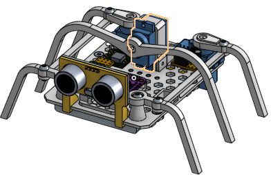
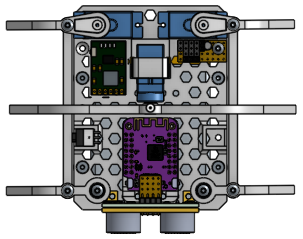
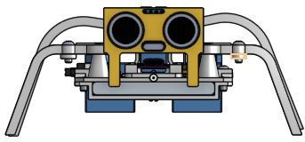
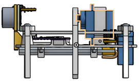

Micro Hexapod Robot
===================

**Table of Content**

1. [Introduction](#introduction)
2. [Locomotion](#locomotion)
3. [Firmware](#firmware)
4. [Operation](#operation)
5. [Development](#development)
	1. [3D Design](#3d-design)
	2. [Firmware](#firmware)
		1. [Dev environment](#dev-environment)
		2. [Firmware upload](#firmware-upload)
		3. [Testing locally](#testing-locally)
3. [Visuals](#visuals)
4. [Resources](#resources)

## Introduction
This is a project to build a micro [hexapod] type robot using only 3 hobby
servos and MCU like ESP32 or similar that has WiFi or Bluetooth connectivity
options. Other sensors, like an [HC-SR04] Ultrasonic Distance sensor, or maybe
an [IMU] could optionally be added. The firmware is written in [MicroPython]

The body is be 3D printed and once all the electronics are tested and
completed, a custom driver board including the MCU, battery management, sensor
drivers and connectors, etc. can be designed and manufactured.

## Locomotion

_TBD - describe the locomotion_

## Firmware

_TBD - describe the code_

## Operation

_TBD - describe how to set up and control the hexapod_

## Development

_TBD - describe the various development aspects_

### 3D Design

### Firmware

#### Dev environment

#### Firmware upload

#### Testing locally

## Visuals

## Resources
* [ArduSnake] - Inspiration for the locomotion used for this project
* [Amplitude, Period, Phase Shift and Frequency](https://www.mathsisfun.com/algebra/amplitude-period-frequency-phase-shift.html) -
  Theory behind the ServoOscillator code, and based on [ArduSnake]
* 3D [design] - The design of the body and parts in [OnShape]

<!-- Links -->
[hexapod]: https://en.wikipedia.org/wiki/Hexapod_(robotics)
[ArduSnake]: https://github.com/Obijuan/ArduSnake
[HC-SR04]: https://www.theengineeringprojects.com/2018/10/introduction-to-hc-sr04-ultrasonic-sensor.html
[IMU]: https://itp.nyu.edu/physcomp/lessons/accelerometers-gyros-and-imus-the-basics/
[design]: https://cad.onshape.com/documents/7f1f6312272fa1634f1a9c3c/w/0b019e5d4fce4172f4dcc484/e/9b3c33fb966bfcde9440cbd6
[OnShape]: https://www.onshape.com/en/
[MicroPython]: https://micropython.org
